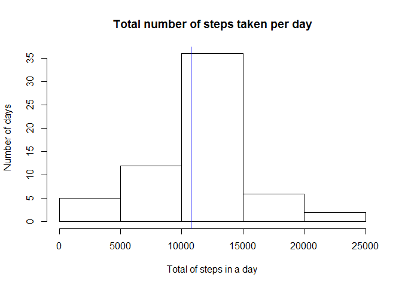

# Reproducible Research: Peer Assessment 1


## Loading and preprocessing the data


```r
act <- read.csv("activity.csv")
act$date <- as.Date(as.character(act$date))
```


## What is mean total number of steps taken per day?

I calculated the total steps per day adding up the steps of each day, given by the 
sum of steps taken in each five minutes interval. 


```r
actTotalStepsPerDay <- tapply(act$steps, act$date, sum, na.rm=TRUE)
hist(actTotalStepsPerDay, main="Total number of steps taken per day", 
     ylab="Number of days", xlab="Total of steps in a day")

colMean <- "red"
colMedian <- "blue"
abline(v=mean(actTotalStepsPerDay), col=colMean, pty=3)
abline(v=median(actTotalStepsPerDay), col = colMedian, pty=3)
```

<!-- -->

```r
mean(actTotalStepsPerDay)
```

```
## [1] 9354.23
```

```r
median(actTotalStepsPerDay)
```

```
## [1] 10395
```


* In more then 25 days, this person walked between 10000 and 15000 steps. 
* The mean total steps per day is marked by the red line and it is 
9354 steps.
* In a median day, the person takes 10395 steps, as marked in the blue line in the histogram.


## What is the average daily activity pattern?

To show the average daily activity, I calculated the mean of steps for each interval, across all days.  


```r
actAverageStepsPerInterval <- tapply(act$steps, act$interval, mean, na.rm=TRUE)

## Removing days which there is no measures
actAverageStepsPerInterval <- actAverageStepsPerInterval[!is.na(actAverageStepsPerInterval)]
plot(x=as.numeric(names(actAverageStepsPerInterval)), y=actAverageStepsPerInterval, type="l", 
     main="Average daily activity", ylab="Mean of steps", xlab="Interval in the day")
```

<!-- -->

* In the plot, we can see that the day start slowly, with almost no steps until the 500th interval. 
* The maximum average of steps, 206, happens in the 835th 
interval of the day
 

## Imputing missing values

NAs values can introduce some bias into some calculations and, because of it, we have to treat it. 

We calculate the number of NAs in the dataset this way:


```r
totalNAs <- sum(is.na(act$steps))
totalNAs
```

```
## [1] 2304
```
To imput missings, I decided to fill the NAs with the mean of all days in that specific interval. 


```r
actNAs <- is.na(act$steps)
act2 <- act[actNAs, ]

for (i in 1: sum(actNAs)) {
      act2$steps[i] <- round(actAverageStepsPerInterval[as.character(act2$interval[i])], 0)
}

actNoNAs <- act
actNoNAs[actNAs, ] <- act2
```

Have imputed the missings, now we plot a histogram, the mean and the median to see if differs from 
the estimates from the first assignment. 


```r
actTotalStepsPerDay2 <- tapply(actNoNAs$steps, actNoNAs$date, sum)
hist(actTotalStepsPerDay2, main="Total number of steps taken per day", 
     ylab="Number of days", xlab="Total of steps in a day")

colMean <- "red"
colMedian <- "blue"
abline(v=mean(actTotalStepsPerDay2), col=colMean, pty=3)
abline(v=median(actTotalStepsPerDay2), col = colMedian, pty=3)
```

<!-- -->

```r
mean(actTotalStepsPerDay2)
```

```
## [1] 10765.64
```

```r
median(actTotalStepsPerDay2)
```

```
## [1] 10762
```

The median and the mean they are almost the same after imputing values to the NAs. And the median values are 
very close. 

## Are there differences in activity patterns between weekdays and weekends?

For doing this, I created a matrix, with tapply, I calculated the mean of steps taken by interval in the 
weekends and weekdays. Then, I ploted.  


```r
## Creating a factor variable with days of week (it is Brazilian Portuguese)
actNoNAs$weekday <- weekdays(actNoNAs$date, abbreviate=TRUE)
actNoNAs$weekend <- (actNoNAs$weekday=="sáb" | actNoNAs$weekday=="dom")
actNoNAs$weekend[!actNoNAs$weekend] <- "Weekday"
actNoNAs$weekend[actNoNAs$weekend==TRUE] <- "Weekend"

## The average of all intervals
actAverageStepsPerInterval2 <- tapply(actNoNAs$steps, INDEX = list(actNoNAs$interval, actNoNAs$weekend), mean, na.rm=TRUE)
df <- as.data.frame(actAverageStepsPerInterval2)

par(mfrow = c(2, 1))
plot(x = as.numeric(unlist(dimnames(df)[1])), y=as.numeric(unlist(df["Weekday"])), type = "l", 
     ylab="Mean of steps", xlab="Interval", ylim=c(0,200))
plot(x = as.numeric(unlist(dimnames(df)[1])), y=as.numeric(unlist(df["Weekend"])), type = "l", 
     ylab="Mean of steps", xlab="Interval", ylim=c(0, 200))
```

<!-- -->

As we can see, in the weekend, the steps are more regular. The mean of steps is greater in the weekends than in the weekdays, but in the 
weekdays we observe more steps in the intervals between 800-1000th. We can see this in the summary, that I printed below. 


```r
summary(df$Weekday)
```

```
##    Min. 1st Qu.  Median    Mean 3rd Qu.    Max. 
##   0.000   2.289  25.810  35.610  50.810 230.400
```

```r
summary(df$Weekend)
```

```
##    Min. 1st Qu.  Median    Mean 3rd Qu.    Max. 
##   0.000   1.234  32.310  42.360  74.610 166.600
```


